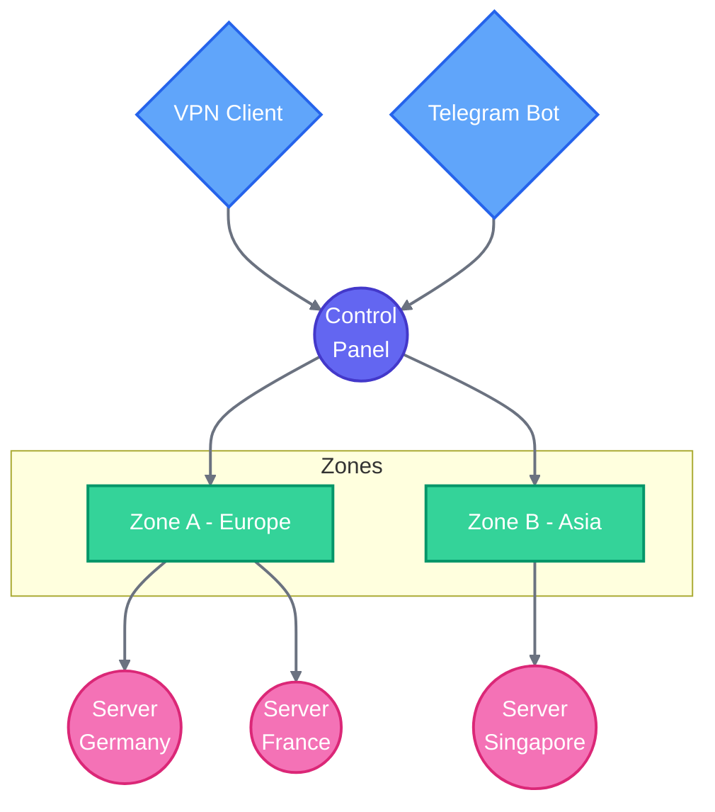

# Elora VPN Manager

> A comprehensive VPN management solution with multi-zone support, automated account management, and real-time monitoring.

[](LICENSE)

## Tutorial Video 📝

<div align="center">

<a href="https://t.me/EloraVPNManager/14">
  
</a>

</div>

## 🚀 Features

### 🌍 Multi-Zone Management
- Distributed server management across multiple zones
- Automatic configuration synchronization
- Load balancing and failover support
- Centralized control panel

### 👥 Account Management
- Automated account creation and deployment
- Shopping system integration
- Traffic monitoring and usage tracking
- Flexible subscription management

### 🔄 Integration
- X-UI panel synchronization
- Telegram bot interface
- Subscription URL system
- Multiple client support

## 📋 System Overview

The system manages VPN services through three main components:



### Core Functions
- Account creation and management
- Traffic monitoring and control
- Server synchronization
- User access management

## 🛠️ Setup Requirements

### Server Side
- SSL certificate
- Domain configuration
- X-UI panel installation
- Database system

### Client Side
- X-ray compatible client
- Telegram account (for bot access)
- Valid subscription URL

## 📱 Access Methods

### 1. Subscription URL
- One-click configuration
- Automatic updates
- Multiple client support

### 2. Telegram Bot
- Account management
- Usage monitoring
- Support access
- Instant notifications

### 3. VPN Clients
- Cross-platform support
- Auto-configuration
- Server selection

## ⚙️ How It Works

1. **Account Creation**
   - Manual or automatic creation
   - Zone assignment
   - Server configuration

2. **Server Sync**
   - Configuration deployment
   - Traffic monitoring
   - Status updates

3. **User Access**
   - Subscription URL generation
   - Client configuration
   - Usage tracking

## 📊 Monitoring Features

- Real-time traffic statistics
- Server status monitoring
- User activity tracking
- System health checks

## 🔐 Security Features

- SSL encryption
- Domain validation
- Access control
- Traffic encryption
- Secure protocols

## ✨ Key Benefits

### For Users
- Easy account management
- Multiple access methods
- Real-time monitoring
- Automatic configuration

### For Administrators
- Centralized management
- Automated operations
- Comprehensive monitoring
- Revenue tracking


# Installation Guide

## System Requirements

### Supported Operating Systems
- Ubuntu 20.04 LTS (Focal Fossa)
- Ubuntu 22.04 LTS (Jammy Jellyfish)
- Debian 11 (Bullseye)
- Debian 12 (Bookworm)

### Minimum Hardware Requirements
- CPU: 1 core
- RAM: 2 GB
- Storage: 10 GB

### Prerequisites
The installation script will automatically install these dependencies, but for reference, the system needs:
- Python 3.9
- PostgreSQL
- systemd
- curl
- Other dependencies will be installed automatically

## Quick Installation

### Option 1: Custom Domain and Port  (Recommended)

For full functionality, including subscription URLs and all features:

```bash
curl -fsSL https://raw.githubusercontent.com/eloravpn/EloraVPNManager/main/install.sh | sudo bash -s -- \
  --domain your-domain.com \
  --port 8080
```

**Why use this method?**

- Ensures all features work correctly
- Enables subscription URL functionality
- Provides better security through domain validation
- Allows proper SSL certificate setup
- Required for production deployments

### Option 2: Quick One-Line Installation
Basic installation using auto-detected public IP (Limited functionality):

Auto-detects your public IP address
```bash
curl -fsSL https://raw.githubusercontent.com/eloravpn/EloraVPNManager/main/install.sh | sudo bash
```
**⚠️ Limitations of IP-based installation:**

* Subscription URLs will not function
* Some features may be restricted
* Not recommended for production use
* SSL certificate setup may be problematic
* Limited security features

Note: For production environments, always use Option 1 with a proper domain name.

### Full Custom Installation
```bash
curl -fsSL https://raw.githubusercontent.com/eloravpn/EloraVPNManager/main/install.sh | sudo bash -s -- \
  --domain your-domain.com \
  --port 8080 \
  --protocol https \
  --db-name custom_db \
  --db-user custom_user \
  --db-pass your_password \
  --jwt-secret your_jwt_secret
```

## Installation Options

| Option | Description | Default |
|--------|-------------|---------|
| `--domain` | Domain name for the application | localhost |
| `--port` | Port number for the application | 8080 |
| `--protocol` | Protocol (http/https) | http |
| `--db-name` | PostgreSQL database name | elora_db |
| `--db-user` | PostgreSQL user name | elora |
| `--db-pass` | PostgreSQL password | Random generated |
| `--jwt-secret` | JWT secret key | Random generated |
| `--version` | Specific version to install | Latest version |


## Updating
To update the application, use one of these commands:

```bash
# Update to latest version
curl -fsSL https://raw.githubusercontent.com/eloravpn/EloraVPNManager/main/install.sh | sudo bash -s -- --update

# Update to specific version
curl -fsSL https://raw.githubusercontent.com/eloravpn/EloraVPNManager/main/install.sh | sudo bash -s -- --update --version v1.2.3
```
- Restart the service


### Domain/IP Configuration
- If no domain is specified, the installer will automatically detect and use your server's public IP
- If public IP detection fails, it will fall back to 'localhost'
- You can always specify a custom domain using the `--domain` option
- The detected or specified domain/IP will be used in the configuration for API endpoints

## Post-Installation

### To see full log

`tail -f /var/log/elora-vpn/elora-vpn.log`

### Configuring IPv6 Support
If your server has IPv6 capability, you can enable IPv6 listening by following these steps:

**1. Access Control Panel**

Log in to your control panel with administrator credentials
Navigate to the Settings menu
Select the Basic tab


**2. Configure IPv6**

Locate the "Uvicorn Host" setting
Change the value from 0.0.0.0 to ::
Click Save to apply changes


**3. Apply Changes**

```
# Restart the panel to activate IPv6 support
sudo systemctl restart elora-vpn
```

#### Verify the service is running
`sudo systemctl status elora-vpn`

Verify IPv6 Connectivity
```
# Check if the service is listening on IPv6
sudo netstat -tulpn | grep elora-vpn
```

#### Test IPv6 connectivity (replace port if different)
`curl -6 http://[::1]:8080/`


Note: Ensure your firewall rules allow incoming connections on both IPv4 and IPv6 for your configured port.
### SSL Certificate Setup

SSL certificates are essential for:

- To work Subscription URL in all V2ray Clients!
- Secure subscription links for V2Ray clients
- Encrypted API communications
- Secure web interface access

#### 1. Install Certbot

```bash
# Install Certbot and Nginx plugin
sudo apt update
sudo apt install -y certbot 
```

```bash
# Stop any service using port 80
sudo systemctl stop elora-vpn

# Get certificate
sudo certbot certonly --standalone --agree-tos --register-unsafely-without-email -d your-domain.com

```

#### 2. Certificate Locations
After successful certification, your certificates will be located at:
```
/etc/letsencrypt/live/your-domain.com/fullchain.pem  # Certificate
/etc/letsencrypt/live/your-domain.com/privkey.pem    # Private Key
```

#### 3. Update Configuration

Access your control panel by logging in with your administrator credentials
Navigate to the SSL configuration:

Click on "Settings" in the main menu
Select the "SSL" tab from the available options

Configure the certificate paths:

In the "SSL Certificate Path" field, enter the full path to your SSL certificate file (e.g., /etc/ssl/certs/your-certificate.crt)
In the "Private Key Path" field, enter the full path to your private key file (e.g., /etc/ssl/private/your-private-key.key)
Double-check that both paths are correct and the files are readable by the panel

Apply the changes:

Click "Save" or "Apply" to confirm your SSL configuration
Restart the panel service to apply the new SSL settings


#### 4. Enable Auto-Renewal
```bash
# Test auto-renewal
sudo certbot renew --dry-run

# Certbot automatically adds a renewal cron job at
# /etc/cron.d/certbot
```

#### 5. Restart Service
```bash
sudo systemctl restart elora-vpn
```

### Service Management
```bash
# Check service status
sudo systemctl status elora-vpn

# Start service
sudo systemctl start elora-vpn

# Stop service
sudo systemctl stop elora-vpn

# Restart service
sudo systemctl restart elora-vpn

# View logs
sudo journalctl -u elora-vpn -f
```
### Configuration Guide

#### Configuration File
The primary configuration settings are stored in the .env file:

`nano '/opt/elora-vpn/.env`

You can customize the panel's behavior through two methods:

**1. Web Interface Settings**

Access the control panel's Settings menu to configure:

General system preferences
User management options
Security settings
Network configurations


**2. Environment File**

For advanced configurations, you can directly edit the .env file. This allows you to:

Set environment-specific variables
Configure database connections
Modify system paths
Enable debug modes
Set API keys and secrets
Define custom service endpoints

Note: After modifying the .env file, restart the panel services to apply changes:
`sudo systemctl restart elora-vpn`

_We recommend using the web interface for routine changes and the .env file for advanced system configurations. Always backup your configuration files before making significant changes._

## 📖 Usage Guidelines

### Administrator Tasks
1. Enable SSL and configure domains
2. Set up zones and servers
3. Monitor system health
4. Manage user accounts

### User Tasks
1. Purchase/activate account
2. Get subscription URL
3. Configure VPN client
4. Monitor usage via bot

## ⚡ Quick Start

1. **System Setup**
   ```bash
   # Install required components
   # Configure SSL
   # Set up domains
   ```

2. **Zone Configuration**
   ```bash
   # Configure zones
   # Set up servers
   # Enable synchronization
   ```

3. **Account Management**
   ```bash
   # Create accounts
   # Monitor usage
   # Manage subscriptions
   ```


### Default Paths
- Installation Directory: `/opt/elora-vpn`
- Virtual Environment: `/opt/elora-vpn/venv`
- Service File: `/etc/systemd/system/elora-vpn.service`

## Troubleshooting

### Common Issues

1. **Port Already in Use**
```bash
# Check if port is already in use
sudo lsof -i :8080
sudo netstat -tulpn | grep 8080

# Test port accessibility
nc -zv localhost 8080

# Configure firewall for port
sudo ufw allow 8080/tcp
sudo ufw status
```

2. **Database Connection Issues**
```bash
# Check PostgreSQL status
sudo systemctl status postgresql

# Check database logs
sudo tail -f /var/log/postgresql/postgresql-*.log
```

3. **Service Won't Start**
```bash
# Check detailed error messages
sudo journalctl -u elora-vpn -n 50 --no-pager

# Verify Python path
sudo systemctl cat elora-vpn

# Check file permissions
sudo ls -la /opt/elora-vpn
sudo ls -la /opt/elora-vpn/venv/bin/python

# Manual start for debugging
cd /opt/elora-vpn
sudo ./venv/bin/python main.py
```
### Recovery Procedures

#### 1. Database Backup and Restore
```bash
# Backup database
sudo -u postgres pg_dump elora_db > backup.sql

# Restore database
sudo -u postgres psql elora_db < backup.sql
```

#### 2. Configuration Backup
```bash
# Backup configuration
sudo cp /opt/elora-vpn/.env /opt/elora-vpn/.env.backup
sudo cp -r /opt/elora-vpn/static /opt/elora-vpn/static.backup
```

#### 3. Complete Reset
```bash
# Stop service
sudo systemctl stop elora-vpn

# Reset database
sudo -u postgres psql -c "DROP DATABASE elora_db;"
sudo -u postgres psql -c "CREATE DATABASE elora_db OWNER elora;"

# Reinstall application
rm -rf /opt/elora-vpn/*
# Run installation script again...
```

### Debug Mode

To enable debug mode for more detailed logging:
1. Edit `.env` file:
```bash
sudo nano /opt/elora-vpn/.env

# Change these settings:
DEBUG=true
LOG_LEVEL=10
```

2. Restart service:
```bash
sudo systemctl restart elora-vpn
```

3. Monitor debug logs:
```bash
sudo journalctl -u elora-vpn -f
```

### System Information Collection

When reporting issues, include this information:
```bash
# System info
uname -a
lsb_release -a

# Installation info
python3.9 --version
pip list
systemctl status elora-vpn

# Logs
journalctl -u elora-vpn --no-pager -n 100

# Database status
sudo -u postgres psql -d elora_db -c "\dx"
```

### Getting Help
If you encounter any issues:
1. Check the logs using the commands above
2. Verify your system meets the minimum requirements
3. [Open an issue](https://github.com/eloravpn/EloraVPNManager/issues) on GitHub

## Security Notes
- The installation script automatically generates secure random passwords for the database and JWT secret
- All configuration files are created with proper permissions
- The `.env` file contains sensitive information and is readable only by root
- Default database user has limited permissions to only the necessary database

## Uninstallation
To completely remove the application:
```bash
sudo systemctl stop elora-vpn
sudo systemctl disable elora-vpn
sudo rm -rf /opt/elora-vpn
sudo rm /etc/systemd/system/elora-vpn.service
sudo systemctl daemon-reload
```

To also remove the database:
```bash
sudo -u postgres psql -c "DROP DATABASE elora_db;"
sudo -u postgres psql -c "DROP USER elora;"
```

##### Admin username and password
Default sudoer username and password is `admin`.

The environment varaibles is SUDO_USERNAME and SUDO_PASSWORD

#### The Web Panel Repository

Follow the Readme in [Elora VPN Manager Panel](https://github.com/eloravpn/EloraVPNManagerPanel)


## 📝 License

This project is licensed under the MIT License - see the [LICENSE](LICENSE) file for details.

## 🤝 Support

For support, please:
- Join our Telegram channel
- Check documentation
- Submit issues via GitHub


### Contact US in Telegram
[Elora VPN](https://t.me/eloravpn)

---

_Made with ❤️ for better VPN management_
